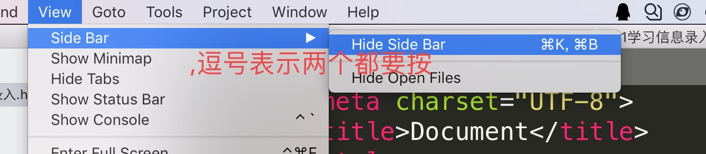

## 一 sublime的使用

### 快捷键

####1.叫不出名字，非常实用，就叫多选吧。shift+control + 下箭头，

window 的可以按住滚轮，

Xcode里面也有这种功能。

效果图如下。

#### 2.影藏显示侧边栏

本机设置的QQ截屏快捷键是 option(alt) +  cmd +j

先按 cmd+B ,在按cmd+k 

## 二 Chrome 的使用

### 快捷键

1,还原原始大小 command + 0（零）

## 三 webstorm

## 四 Firework

## 五 Photoshop

