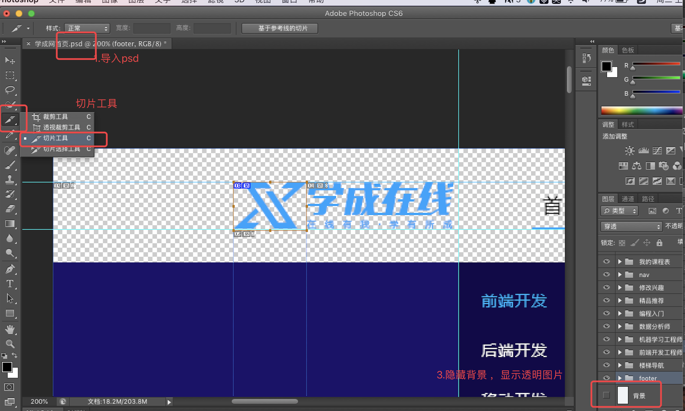
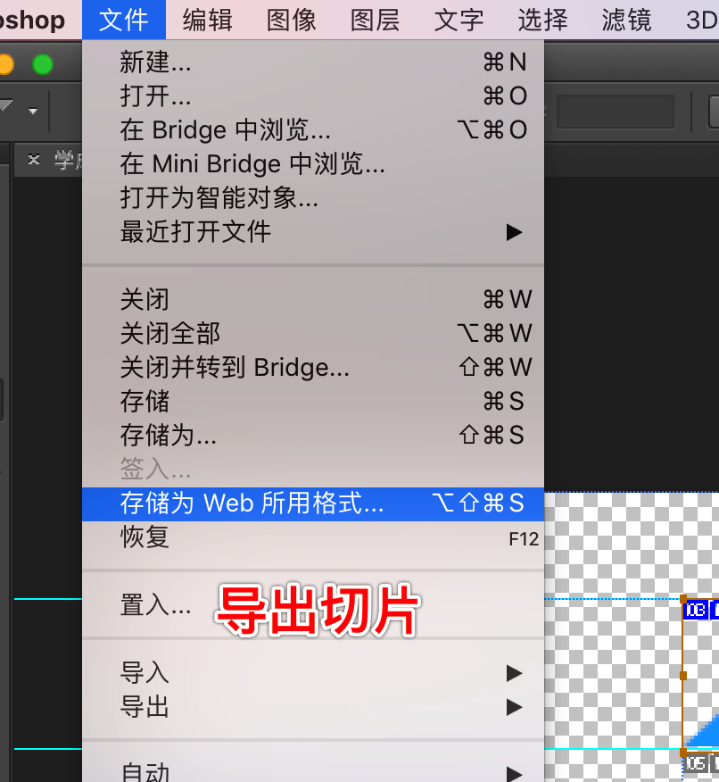
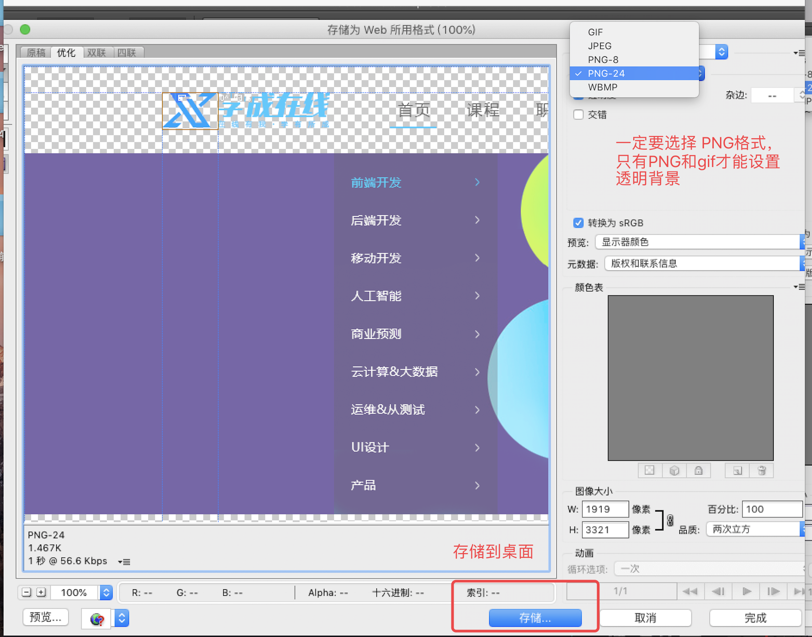
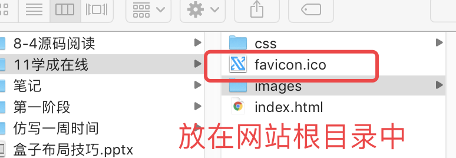

学成在线综合案例

## 1.学成在线搭建和ico图标制作

### 1.项目目录结构

###2.Icon 图标制作

思路：切图表，在线转换为ico图标，在html文件中引入ico图标

注意：favicon.ico 放在网站根目录中。

1.ps打开psd文件，才好进行切图。




2.导出切片：文件—>存储为web格式



3.选择png-24格式，保存到左面




将图片转换成ico图标 : http://www.bitbug.net/ 



引入：favicon.ico 图标，放在网站根目录中。

```
<link rel="shortcut icon" href="favicon.ico" /> 
```

### 3.小问题：文字对齐问题

```
display:inline-block;
vertical-align:middle;
```