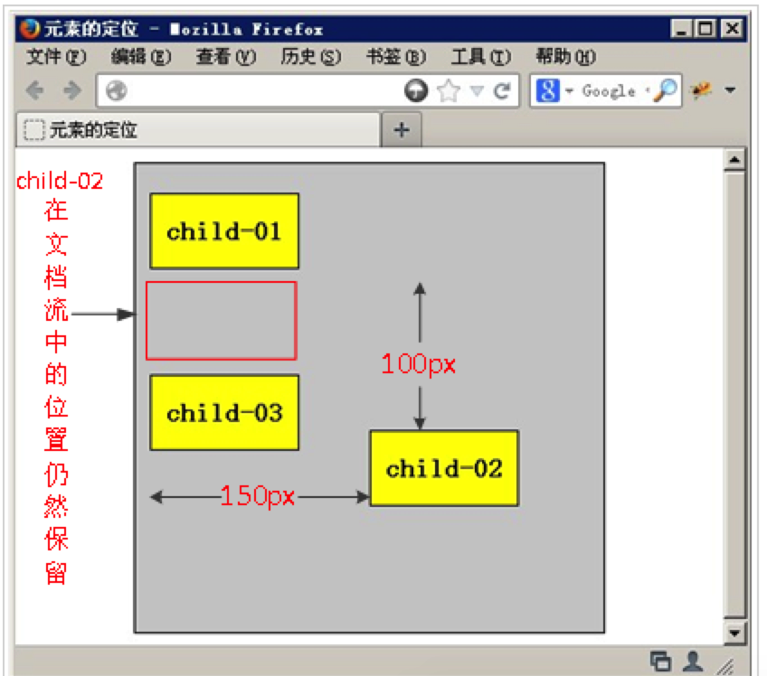

浮动

### 一、浮动：float

####1.普通流 (normal flow)

网页布局的核心就是用CSS摆放盒子位置，如何把盒子放到合适的位置？

CSS的定位机制有3种：普通流(标准流)、浮动、定位

html标记语言中另外一个很重要的概念就是：标准流！也叫普通流，标准流实际上就是一个网页内标签元素从上到下，从左到右排列顺序的意思。eg:块级元素会独占一行，行内元素会按顺序依次排列，按照这种大前提的布局排列绝对不会出现例外的情况叫做标准流。


#### 2.什么是浮动？

浮动：指设置了浮动属性的盒子会脱离标准流的控制，移动到父元素中指定位置的过程。

在CSS中，通过float来定义浮动，语法格式如下：

```
选择器{float:属性值；}
```

| 属性值 | 描述               |
| :----- | ------------------ |
| left   | 元素向左浮动       |
| right  | 向右浮动           |
| none   | 元素不浮动(默认值) |

#### 3.浮动详细内幕特性

浮动脱离标准流，”脱标“  ，不占位置，会影响标准流。浮动只有左右浮动。

```
1.浮动首先创建包含块的概念(包裹)。也就是说：浮动总是找离他最近的父级元素对齐。但不会超出内边距范围。
```


```
2.一个父盒子里面的子盒子，如果有一个浮动，则其他的子级都要浮动。这样才能一行对齐显示。
```

```
3.元素添加浮动后,会转换为行内块。元素的大小取决于定义的大小或默认的内容多少显示。
```

#### 4.总结：浮动：float 浮 漏 特

浮动的目的就是为了让多个块级元素一行显示，最关键的核心点就是，怎么排列的，是否占位位置。

float 浮 漏 特

浮：加了浮动的元素是浮起来的，漂在其他标准流的盒子上面。

漏：加了浮动的盒子，不占位置，浮起来了，原来的位置漏给了标准流的盒子。

特：特别注意，首先浮动的盒子需要和标准流的父级盒子搭配使用。其次，特变注意浮动的元素会进行：行内块转换。⚠️⚠️⚠️⚠️


### 二 浮动的特点：

1.浮动的元素不占位置，所以会影响后面的人

2.浮动的元素一排显示，中间没有缝隙

3.浮动，默认会转换为行内块元素 (宽高由内容撑大。一个div不给宽高)

   


### 三 为什么要清除浮动：

#### 1.主要是解决父元素没有高的问题：

清除浮动的本质：主要为了解决父元素因为子盒子浮动导致的内部高度为0的问题。父盒子有高就不怕浮动。


标准流：父盒子高度由内容撑开

浮动后：浮动的元素不占位置，无法撑开父盒子的高度，父盒子没有高，就会影响下面的元素。

简而言之：清除浮动，主要是为了解决父盒子没有高度的问题。

不清楚浮动，你就给父盒子一个高度，有时候高度不能写死，建议还是清楚浮动吧。

见下图：


#### 2 如何清除浮动

其本质叫做闭合浮动更好一些，记住，清除浮动就是把浮动的盒子圈到里面让父盒子闭合出口和入口不让他们出来影响其他元素。

有高度的父亲才能关住浮动。

##### 2-1额外外标签法

```
是W3C推荐的做法是通过在浮动元素末尾添加一个空的标签例如 <div style=”clear:both”></div>，或则其他标签br等亦可。
```

缺点：不值得拥有，添加许多无意义的标签，结构化奇差。

##### 2-2 父级添加overflow属性方法

可以通过触发BFC ，实现清除浮动的效果

```
可以给父级添加：overflow:hidden  | auto | scroll 都可以清除浮动
```

##### 2-3 使用 after伪元素清除浮动 常用

:after 方式为空元素的升级版，好处是不需要单独添加标签。

使用方法：复制粘贴下面的代码 

```
 .clearfix:after {  content: ""; display: block; height: 0; clear: both; visibility: hidden;  }   

 .clearfix {*zoom: 1;}   /* IE6、7 专有 */
```

优点 ：符合闭合浮动思想，结构语义化正确 

缺点：由于IE6-7不支持:after ,使用 zoom:1 触发 hasLayout

代表网站：百度、淘宝网、网易、小米等 

注意：content :"" 尽量不带点。

##### 2-4 使用before和after双伪元素清除浮动

使用方法：

```
.clearfix:before,.clearfix:after { 
  content:"";
  display:table;  /* 这句话可以出发BFC BFC可以清除浮动,BFC我们后面讲 */
}
.clearfix:after {
 clear:both;
}
.clearfix {
  *zoom:1;
}
```

优点：代码更简洁

缺点：由于IE6-7不支持:after , 使用 zoom:1触发hasLayout。

代表网站：小米、腾讯。

###  四：定位

#### 1.简介：

如果说浮动，关键点在于“浮”上；定位的关键就在于“定”上，定位再布局中很重要，在做js特效的时候，会大量用到定位。

#### 2.为什么要用定位?应用场景

定位最常用的场景有哪些？先看几张图

第一幅图：小方块可以任意移动。


第二幅图：左右箭头压住图片


第三幅图：hot盒子外面多一块，更加突出。


如果用标准流or浮动你给我实现上述效果试试，用定位just soso !

第四个应用场景: 精灵图

background-position: 背景定位。

#### 3.元素的定位属性

1、元素的定位属性主要包括两部分：定位模式和边偏移。

| 边偏移 |                                    |
| ------ | ---------------------------------- |
| top    | 定位元素相对于其父元素上边线的距离 |
| bottom | 下边线的距离                       |
| left   | 左边线的距离                       |
| right  | 右边线的距离                       |

也就是说，定位要和边偏移搭配使用，

```
position:absolute;
left:100px, bottom:10px; //定位之后，便把边偏移写上。
```

2、定位模式(定位的分类)

在css中，position属性用于定义元素的定位模式，语法格式如下

选择器{position:属性值;}

position属性的常用值

| 值       | 描述                                           |
| -------- | ---------------------------------------------- |
| static   | 自动定位(默认)                                 |
| relative | 相对定位，相对于其源文档流的位置进行定位       |
| absolute | 绝对定位，相对于离他最近的有定位的盒子进行定位 |
| fixed    | 固定定位，相对于浏览器窗口进行定位。           |


####4.静态定位(static)

网页中的所有元素，默认都是静态定位。就是标准流的特性。

静态定位唯一的用处：就是取消定位。 position:static；

PS：没啥好说的。

#### 5.相对定位relative(自恋型)

相对定位：将元素相对于它在标准流中的位置进行定位。不脱标，还占位，可以通过边便宜移动位置。相对定位展示效果如下图：



注意：

1.⚠️ 占位，可以通过边偏移移动位置，但原来所占位置，继续占有。

不会进行模式转换。

2.每次移动位置，都是一自己的左上角为基点移动(相对于自己来移动位置，所以说是自恋型

that is:相对定位的盒子原位置保留，他后面的盒子任以标准流的方式对待他(相对定位不脱标)

如果说浮动的目的是多个块级元素一行显示，那么定位的作用就是移动位置，让盒子到我们想要去得地方。

#### 6.绝对定位absolute(拼爹型)

```
小笑话：

吃早饭时，老婆往儿子碗里放了两个煎蛋，儿子全给了我，还一本正经地说：“爸爸，多吃点，男人养家不容易。” <br/>

我一阵感动，刚想夸他两句。 

儿子接着说：“以后全靠你让我拼爹了！”
```

```
position:absolute;
left:0;
right:0;
```

绝对定位的盒子可以修改边偏移移动位置。

注意：⚠️最重要的一点，完全脱标，完全不占位置。⚠️会有模式转换：行内块。

##### 6-1 父级没有定位

若所有父元素都没有定位，以浏览器当前屏幕为准进行对齐。

#####6-2 父级有定位

最近有定位的父盒子为准。

##### 6-3 子绝父相

1、定位的口诀：自绝父相，子盒子使用absolute绝对定位，父盒子就使用relative相对定位。


2、为什么子绝父相，原理？：占不占位？

占位，别影响后面的元素！！！！

不占位置，就会影响到后面的元素；就想为什么要清除浮动？浮动的元素父盒子高度为0 ，不占位置，会影响后面的盒子，不要影响后面的盒子？

下图页面效果，下怎么实现：


Position:absolute 绝对定位，不占位置，会影响后的盒子，

realtive:相对定位占位置，

如果蓝色盒子也使用绝对定位，不占位置，会影响，下面红色的盒子，跑到上上面去了。确保蓝色的盒子不影响后的盒子就必须使用relative，只有位置，里面的子元素，使用绝对定位，随便跑。

#### 7.绝对定位的盒子水平/垂直居中

1.水平居中

先往右走父盒子的一般，在往回到自己的一半

```
{
	width: 400px;
	height: 100px;
	background-color: red;
	position: absolute;
	/*水平居中*/
	left: 50%; /*先走父盒子的一般*/
	margin-left: -200px; /*再往回走自己宽度的一半*/
}
```

图解：


####8. 固定定位fixed(认死理型)

固定定位(position:fixed)：一种特殊的定位，eg:正方形是一种特殊的矩形，

以浏览器屏幕作为参照进行定位。

固定定位的元素：

```
1.，跟父元素无关，只认浏览器。
2.脱标，不占位置，不随滚动条滚动。
3.IE6 等低版本浏览器不支持固定定位。
```


#### 9.叠放次序

当对多个元素同时设置定位时，定位元素之间可能会反生重叠。


在css中，要想调整重叠定位元素的位置，可丢定位元素使用z-index：层叠等级属性，取值范围： 负整数 0 ，正整数

eg: z-index: 2 

```
1.只有定位(relative，absolute、fixed)的盒子才能使用 z-index:
2.z-index 默认值：0，值越大，定位元素越居上。
3.后面的数字一定不能加单位。
```


### 五、四种定位总结

| 定位模式     | 是否脱标       | 是否可以使用边偏移 | 移动位置基准                 | 是否有模式转换 |
| ------------ | -------------- | ------------------ | ---------------------------- | -------------- |
| static静态   | 不             | 否                 | 正常模式                     | 否             |
| relative相对 | 脱标，占位置   | ✅                  | 相对自身移动位置（自恋型）   | 否             |
| absolute绝对 | 脱标，不占位置 | ✅                  | 最近的有定位的父盒子（拼爹） | ✅，行内块      |
| fixed固定    | 脱标，不占位置 | ✅                  | 相对于浏览器移动位置(认识理) | ✅ 行内块       |


### 六、定位模式转换

跟浮动一样，添加了绝对定位(absolute)、固定定位的元素(fixed) , 会进行模式转换:转换为行内块元素。

行内块元素的高度、宽度跟内容有关。

So ： 行内元素添加浮动(float)、固定定位(fixed)、绝对定位(absolute) 后，不用写模式转换，就可以设置宽高了。


